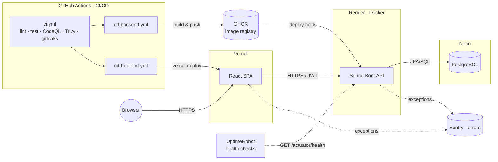
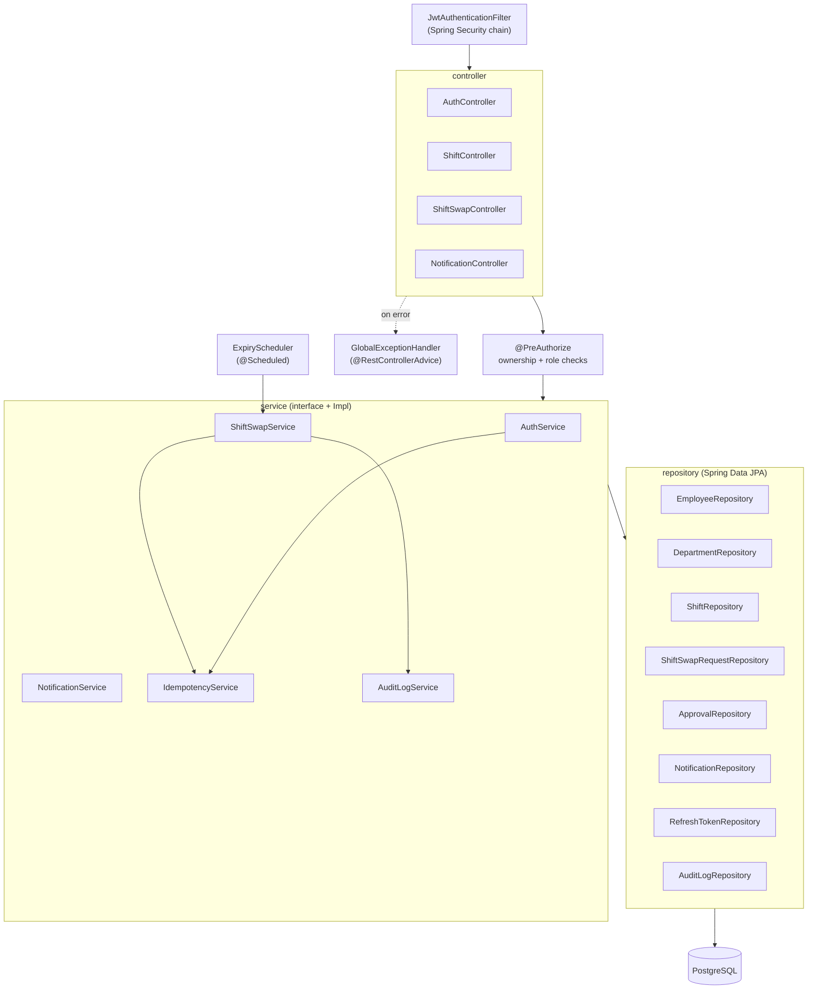
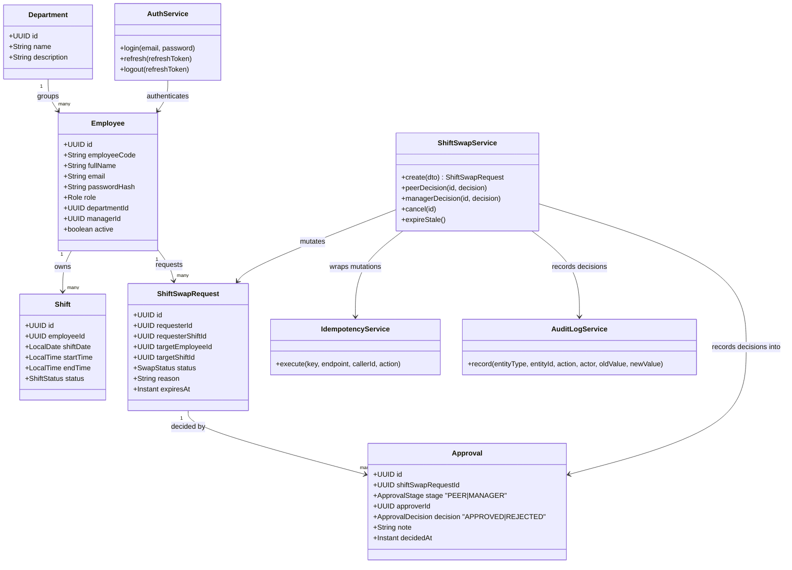
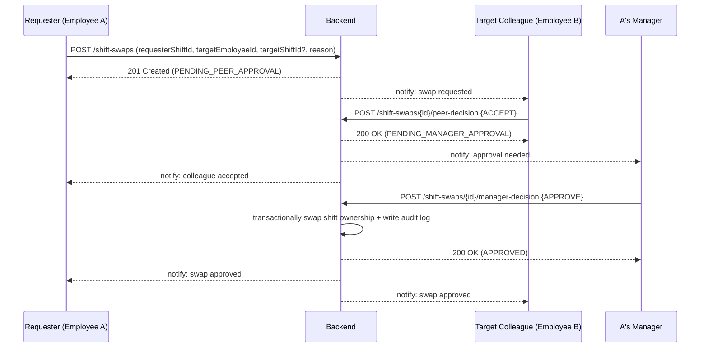
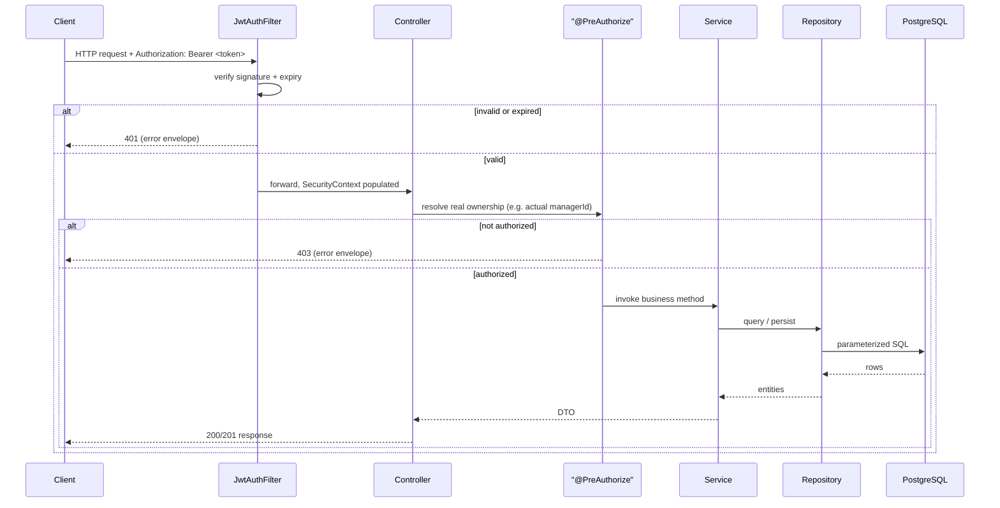
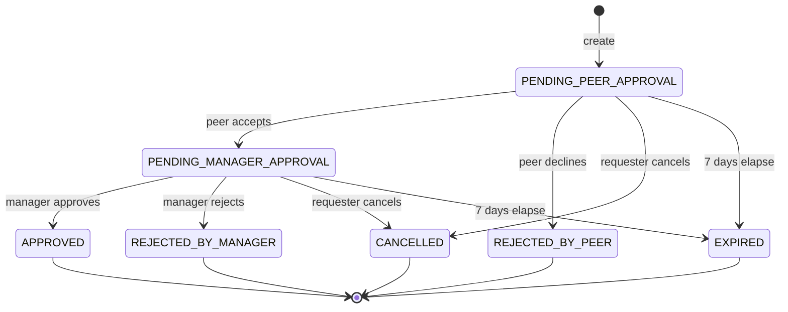
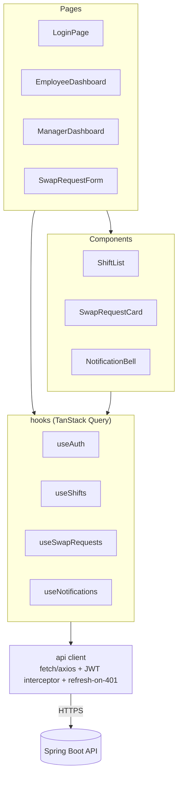
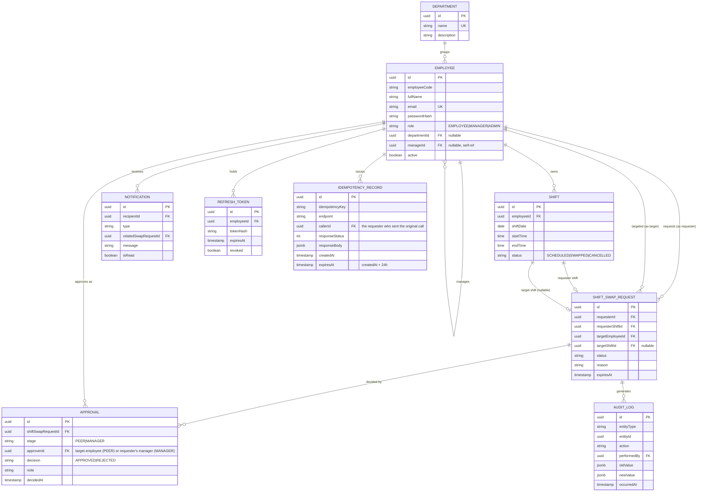

# HR Shift Swap Service — Specification

A standalone HR feature that lets employees request to swap shifts with a colleague. The colleague must accept the swap, and the requester's manager gives final approval before the shift assignments change.

**Stack:** React (TypeScript) frontend · Java 21 / Spring Boot backend · PostgreSQL · Docker (local) · GitHub Actions → Render + Neon + Vercel (free-tier live deployment)

> **This is the spec, written before implementation.** It is the contract implementation must follow: FRs/NFRs, architecture, data model, API, deployment/rollback, security, monitoring, and test strategy. Code lands in subsequent steps against this fixed target — see [Execution Order](#execution-order).

---

## Table of Contents
1. [Functional Requirements](#functional-requirements)
2. [Non-Functional Requirements](#non-functional-requirements)
3. [Architecture](#architecture)
   - [High-Level Design (HLD)](#high-level-design-hld)
   - [Low-Level Design (LLD)](#low-level-design-lld)
4. [Domain Model / ERD](#domain-model--erd)
5. [Tech Stack & Rationale](#tech-stack--rationale)
6. [Architecture Decision Records](#architecture-decision-records)
7. [API Contract](#api-contract)
8. [Database](#database)
9. [Local Development](#local-development)
10. [Deployment Strategy](#deployment-strategy)
11. [Rollback Strategy](#rollback-strategy)
12. [Security & Vulnerability Scanning](#security--vulnerability-scanning)
13. [Threat Model](#threat-model)
14. [Monitoring & Logging](#monitoring--logging)
15. [Testing Strategy](#testing-strategy)
16. [Developer Workflow](#developer-workflow)
17. [Repository Structure](#repository-structure)
18. [Execution Order](#execution-order)

---

## Functional Requirements

| ID | Requirement |
|----|-------------|
| FR-1 | An employee can view their own upcoming shifts. |
| FR-2 | An employee can request to swap one of their own upcoming (not-yet-started) shifts with a colleague's shift, or offer their shift up for a colleague to simply cover (no shift given back). |
| FR-3 | A swap request must include a reason. |
| FR-4 | The target colleague can **accept** or **decline** a swap request addressed to them. |
| FR-5 | If the colleague accepts, the request routes to the **requester's manager** for final approval. |
| FR-6 | If the colleague declines, the request is closed (`REJECTED_BY_PEER`) and the requester is notified — it never reaches the manager. |
| FR-7 | The manager can **approve** or **reject** a request that has cleared peer acceptance. |
| FR-8 | Approval atomically updates the affected shift(s)' ownership; both employees and, where relevant, the manager are notified of the outcome. |
| FR-9 | The requester can **cancel** their own request at any point before it reaches a terminal state (approved/rejected/expired). |
| FR-10 | Requests left un-actioned for 7 days auto-expire (`EXPIRED`) and notify the requester. |
| FR-11 | Employees and managers can see the history and current status of requests they're party to (as requester, target, or approving manager). |
| FR-12 | Only the requester's actual manager (per org hierarchy) may approve/reject that requester's swap — not an arbitrary manager. |
| FR-13 | Users authenticate with email + password; sessions are maintained via JWT. |

## Non-Functional Requirements

| Category | Requirement |
|----------|-------------|
| **Security** | Passwords hashed with BCrypt; short-lived JWT access tokens + rotating, revocable refresh tokens; RBAC enforced server-side on every mutating endpoint; all traffic over HTTPS in production. |
| **Auditability** | Every swap decision and auth event (login success/failure) is written to an immutable `audit_log` table, independent of ephemeral application logs. |
| **Availability** | Target ≥99% during business hours on free-tier hosting; documented cold-start caveat (Render free tier spins down on idle — first request after idle can take 30–50s). |
| **Performance** | p95 API latency <300ms under normal (non-cold-start) load for all non-report endpoints. |
| **Data integrity** | Shift-swap approval is a single DB transaction — partial application (e.g., one shift updated but not the other, or a status flip without an audit row) must be impossible. |
| **Observability** | Structured JSON logs with request-correlation IDs; health/metrics via Spring Actuator; error tracking via Sentry free tier. |
| **Maintainability** | Schema changes only via versioned, forward-only Flyway migrations. |
| **Portability** | Entire stack runs locally via a single `docker compose up`, independent of any cloud account. |
| **Cost** | Fully operable on free tiers (Render, Neon, Vercel, GHCR, GitHub Actions) with no required paid add-ons. |
| **Testability** | Core swap-approval and auth logic covered by unit + integration tests; primary user journey covered by an e2e test. |

## Architecture

### High-Level Design (HLD)

System context: how the SPA, API, database, CI/CD pipeline, and observability tooling fit together across the free-tier deployment topology.



### Low-Level Design (LLD)

#### Backend layered architecture

Request flow through the Spring Boot app: security filter chain → controllers → method-security ownership checks → services → repositories, with cross-cutting concerns (exception handling, idempotency, audit, scheduled expiry) attached at the service layer.



#### Backend domain & service classes



#### Core approval flow



If B declines, or M rejects, the request closes at that step (`REJECTED_BY_PEER` / `REJECTED_BY_MANAGER`) and only the requester is notified — it does not proceed further.

#### Auth request flow (JWT filter chain)



#### ShiftSwapRequest state machine



#### Frontend component structure



## Domain Model / ERD



Each decision in the two-stage workflow (peer accept/decline, manager approve/reject) is a separate `APPROVAL` row rather than columns on `SHIFT_SWAP_REQUEST` — see [ADR-0007](docs/adr/0007-separate-department-and-approval-entities.md). "Who may decide the MANAGER stage" is resolved dynamically from the requester's current `managerId` at decision time, not snapshotted on the request.

`IDEMPOTENCY_RECORD` backs the `Idempotency-Key` behavior defined in [API Contract](#api-contract): one row per `(idempotencyKey, endpoint, callerId)` — enforced as a composite unique constraint — storing the original response so a retried request with the same key gets replayed instead of re-executed. Rows past `expiresAt` (24h after `createdAt`) are inert; the key becomes reusable at that point.

`ShiftSwapRequest.status` state machine is diagrammed in [Low-Level Design (LLD) → ShiftSwapRequest state machine](#shiftswaprequest-state-machine).

## Tech Stack & Rationale

| Layer | Choice | Why |
|-------|--------|-----|
| Backend | Java 21 + Spring Boot 3.3 | Mature ecosystem for transactional, security-heavy business apps; Spring Security + Spring Data JPA cover auth and persistence with minimal boilerplate; matches the requested stack. |
| Database | **PostgreSQL** | The domain is fundamentally relational and transactional: a manager's approval must atomically update two `shift` rows, the request status, and an audit row — a document store would force this consistency to be re-implemented in application code. FK constraints naturally express the employee↔manager hierarchy and the shift/request relationships. Neon offers a durable, no-expiry free tier with branching for safe pre-migration snapshots. |
| Migrations | Flyway | Versioned, forward-only, reviewable-in-PR schema changes; integrates directly with Spring Boot startup. |
| Auth | Self-issued JWT (short-lived access + rotating hashed refresh token) | Stateless access-token verification scales without a session store; hashing refresh tokens at rest means a DB leak doesn't hand out live credentials, and rotation lets us revoke a compromised session. |
| API docs | springdoc-openapi (Swagger UI) | Auto-generated from the controllers/DTOs, always in sync with the code. |
| Frontend | React 18 + TypeScript + Vite | Requested stack; Vite gives fast local iteration and a small, static production build well-suited to free static hosting. |
| Frontend data layer | TanStack Query | Caching, refetch-on-focus, and optimistic updates for the swap-request list without hand-rolled state management. |
| Frontend styling | Tailwind CSS | Fast to build consistent UI without a component-library dependency. |
| Local dev | Docker Compose | One command (`docker compose up`) brings up Postgres + backend + frontend identically for every contributor. |
| CI/CD | GitHub Actions | Free for this use case; explicit, reviewable pipeline (vs. relying on a platform's implicit auto-deploy) as requested. |
| Backend hosting | Render (Docker) | Free web-service tier that runs an arbitrary Dockerfile; supports deploy hooks for Actions-driven deploys and one-click rollback in the dashboard as a fallback. |
| DB hosting | Neon | Free Postgres tier that doesn't expire/pause data, plus branching for safe migration testing. |
| Frontend hosting | Vercel | Best-in-class free static hosting/CDN for a Vite/React build, with a CLI usable from GitHub Actions. |
| Error tracking | Sentry (free tier) | 5k events/month is generous for this scale; one line of setup on both frontend and backend. |

## Architecture Decision Records

Key decisions are captured as ADRs (MADR-style: Context / Decision / Consequences) under `docs/adr/`, so the "why" survives independently of this spec and of whoever made the call. Superseding a decision means adding a new ADR that supersedes the old one, not editing history.

| ADR | Title | Status |
|---|---|---|
| [0001](docs/adr/0001-postgresql-over-nosql.md) | Use PostgreSQL, not a document store | Accepted |
| [0002](docs/adr/0002-peer-accept-then-manager-approval.md) | Swap workflow is peer-accept, then manager-approve (not direct-to-manager) | Accepted |
| [0003](docs/adr/0003-jwt-access-refresh-auth.md) | Self-issued JWT with rotating refresh tokens over server-side sessions | Accepted |
| [0004](docs/adr/0004-free-tier-hosting-topology.md) | Render + Neon + Vercel as the free-tier hosting topology | Accepted |
| [0005](docs/adr/0005-github-actions-explicit-deploy.md) | GitHub Actions drives deploys explicitly rather than platform auto-deploy | Accepted |
| [0006](docs/adr/0006-standalone-employee-directory.md) | This service owns its own Employee/Auth model rather than integrating an external HR system | Accepted |
| [0007](docs/adr/0007-separate-department-and-approval-entities.md) | Department and Approval are separate entities, not a string field and inline columns | Accepted |

Each ADR file follows this template:
```markdown
# ADR-000X: <Title>
Status: Proposed | Accepted | Superseded by ADR-00YY
Date: YYYY-MM-DD

## Context
What forces/constraints led to needing a decision.

## Decision
The choice made, stated as a single clear sentence.

## Consequences
What becomes easier or harder as a result; trade-offs accepted.
```

New architecturally-significant decisions during implementation (e.g., picking a specific rate-limiting library, changing an index strategy) get their own ADR rather than being buried in a PR description.

## API Contract

Base path: `/api/v1`, JSON over HTTPS. All endpoints except `/auth/login` and `/auth/refresh` require `Authorization: Bearer <accessToken>`. API is versioned via the URL path (`/api/v1`); a breaking change ships as `/api/v2` rather than mutating `v1` in place, with `v1` deprecated on a documented timeline.

### Conventions
- **Error envelope** (all non-2xx responses):
  ```json
  {
    "error": {
      "code": "SWAP_NOT_PEER",
      "message": "Only the target employee can accept or decline this request.",
      "traceId": "a1b2c3d4"
    }
  }
  ```
  `traceId` matches the MDC request-correlation ID in the logs (see [Monitoring & Logging](#monitoring--logging)), so a user-reported error can be pinpointed in logs/Sentry directly.
- **Status codes**: `200` read/decision success, `201` resource created, `400` validation error, `401` missing/invalid/expired token, `403` authenticated but not authorized for this resource (e.g., non-target trying to peer-decide), `404` not found or not visible to the caller (same code for both, to avoid leaking existence), `409` conflict (e.g., decision on a request no longer in a decidable state, duplicate create), `422` semantically invalid (e.g., swapping with yourself, past-dated shift).
- **Pagination**: list endpoints (`/shift-swaps/me`, `/shift-swaps/team`, `/notifications`) accept `?page=0&size=20` (0-indexed) and return `{content: [...], page, size, totalElements, totalPages}`.
- **Idempotency**: all mutating swap-decision endpoints (`peer-decision`, `manager-decision`, `cancel`, and `POST /shift-swaps` itself) accept an `Idempotency-Key` header (client-generated UUID). The server stores `(idempotency_key, endpoint, requester_id) → response` for 24h; a retried request with the same key returns the original response instead of re-executing the side effect. This is what makes "the client retried a timed-out approval" safe rather than a double-swap. See [Testing Strategy](#testing-strategy) for the tests that pin this behavior down.

### Auth
| Method | Path | Description |
|---|---|---|
| POST | `/auth/login` | `{email, password}` → `{accessToken, refreshToken, expiresIn}` |
| POST | `/auth/refresh` | `{refreshToken}` → new access token; rotates the refresh token |
| POST | `/auth/logout` | Revokes the given refresh token |
| GET | `/auth/me` | Current employee's profile |

<details>
<summary>Example: <code>POST /auth/login</code></summary>

Request:
```json
{ "email": "alice@example.com", "password": "correct horse battery staple" }
```
Response `200`:
```json
{ "accessToken": "eyJhbGciOi...", "refreshToken": "8f14e45f...", "expiresIn": 900 }
```
Response `401`:
```json
{ "error": { "code": "INVALID_CREDENTIALS", "message": "Email or password is incorrect.", "traceId": "9f2b..." } }
```
</details>

### Employees & Shifts
| Method | Path | Description |
|---|---|---|
| GET | `/employees/me` | Own profile |
| GET | `/employees/team` | Manager only — direct reports |
| GET | `/employees/colleagues` | Other active employees sharing your manager — who FR-2 lets you swap with (added during frontend work; not in the original endpoint list) |
| GET | `/shifts/me?from=&to=` | Own shifts in range |
| GET | `/shifts/{id}` | Single shift (owner or their manager) |

### Shift Swap Requests
| Method | Path | Description |
|---|---|---|
| POST | `/shift-swaps` | Create a request: `{requesterShiftId, targetEmployeeId, targetShiftId?, reason}` |
| GET | `/shift-swaps/me` | Requests where I'm requester or target (paginated) |
| GET | `/shift-swaps/team` | Manager only — requests pending/decided for their reports (paginated) |
| GET | `/shift-swaps/{id}` | Single request (any party to it) |
| POST | `/shift-swaps/{id}/peer-decision` | Target only: `{approve: boolean, comments?}` — `approve: true` = accept, `false` = decline |
| POST | `/shift-swaps/{id}/manager-decision` | Requester's manager only: `{approve: boolean, comments?}` — `approve: true` = approve, `false` = reject |
| POST | `/shift-swaps/{id}/cancel` | Requester only, non-terminal states only |

<details>
<summary>Example: <code>POST /shift-swaps</code></summary>

Request (headers: `Authorization: Bearer <token>`, `Idempotency-Key: 3fa85f64-...`):
```json
{
  "requesterShiftId": "b3f1...",
  "targetEmployeeId": "c9a2...",
  "targetShiftId": null,
  "reason": "Family event, need coverage for the evening shift"
}
```
Response `201`:
```json
{
  "id": "d4e5...",
  "status": "PENDING_PEER_APPROVAL",
  "requesterId": "a1b2...",
  "requesterShiftId": "b3f1...",
  "targetEmployeeId": "c9a2...",
  "targetShiftId": null,
  "reason": "Family event, need coverage for the evening shift",
  "approvals": [],
  "createdAt": "2026-07-25T10:00:00Z",
  "expiresAt": "2026-08-01T10:00:00Z"
}
```
Response `422` (past-dated shift):
```json
{ "error": { "code": "SHIFT_NOT_FUTURE", "message": "Cannot swap a shift that has already started.", "traceId": "7a1c..." } }
```
Response `409` (retried with the same Idempotency-Key after the request already exists):
```json
{ "id": "d4e5...", "status": "PENDING_PEER_APPROVAL", "...": "identical to the original 201 body, replayed, HTTP 201 not 409" }
```
</details>

<details>
<summary>Example: <code>POST /shift-swaps/{id}/manager-decision</code></summary>

Request:
```json
{ "approve": true, "comments": "Approved, coverage confirmed with staffing." }
```
Response `200`:
```json
{
  "id": "d4e5...",
  "status": "APPROVED",
  "approvals": [
    { "stage": "PEER", "approverId": "c9a2...", "decision": "APPROVED", "note": null, "decidedAt": "2026-07-25T14:00:00Z" },
    { "stage": "MANAGER", "approverId": "e7f8...", "decision": "APPROVED", "note": "Approved, coverage confirmed with staffing.", "decidedAt": "2026-07-26T09:15:00Z" }
  ]
}
```
Response `403` (caller is not this requester's actual manager):
```json
{ "error": { "code": "NOT_REQUESTERS_MANAGER", "message": "You are not authorized to decide this request.", "traceId": "44de..." } }
```
Response `409` (already decided — e.g., a retried click without the idempotency key, or a genuine double-submit):
```json
{ "error": { "code": "ALREADY_DECIDED", "message": "This request is no longer pending manager approval.", "traceId": "88ff..." } }
```
</details>

### Notifications & Ops
| Method | Path | Description |
|---|---|---|
| GET | `/notifications?unread=true` | List notifications (paginated) |
| POST | `/notifications/{id}/read` | Mark as read |
| GET | `/actuator/health` \| `/info` \| `/metrics` | Ops/health endpoints (Render health-check target) |

## Database

- Engine: PostgreSQL 16 (Neon in production, `postgres:16` image locally).
- Schema managed by Flyway migrations under `backend/src/main/resources/db/migration/`, starting with `V1__init_schema.sql` (tables per the [ERD](#domain-model--erd) above — `department`, `employee`, `shift`, `shift_swap_request`, `approval`, `notification`, `refresh_token`, `audit_log`, `idempotency_record` — with FKs and indexes on `shift(employee_id, shift_date)`, `shift_swap_request(status)`, `approval(shift_swap_request_id, stage)` unique, `notification(recipient_id, is_read)`, and `idempotency_record(idempotency_key, endpoint, caller_id)` unique).
- All schema changes are forward-only, versioned migrations reviewed in PRs — never manual production DDL.

## Local Development

### Prerequisites

| Path | Requirement |
|---|---|
| **Docker Compose** (recommended — matches every contributor's environment identically) | Docker Desktop or a compatible engine, with Compose v2. Nothing else needs to be installed locally: Postgres, the backend JRE, and the frontend Node runtime all run inside the containers. |
| **Running a service directly on the host** (faster edit/reload loop while actively developing just the backend or just the frontend) | Backend: **JDK 21 specifically** and Maven 3.9+, plus a local PostgreSQL 16 instance with a `shiftswap`/`shiftswap` role and database (matching `backend/src/main/resources/application-local.yml`). `java -version` must report `21.x` on whatever `JAVA_HOME` Maven resolves — a newer JDK (e.g. 25) breaks Lombok's annotation processing, since Lombok trails new JDK releases; getters/setters/builders then silently fail to generate and the build fails with a wall of "cannot find symbol" errors that look unrelated to Lombok. If multiple JDKs are installed, pin `JAVA_HOME` explicitly rather than relying on whichever one a package manager (e.g. Homebrew) symlinks as the unversioned default. Frontend: Node 20+ and npm. |

Either path needs ports `5173` (frontend), `8080` (backend), and `5432` (Postgres) free on the host.

### Running

```bash
docker compose up --build
```
Brings up Postgres, the Spring Boot API (with Flyway migrations applied automatically on boot), and the React app, wired together with sane defaults for local-only secrets (see `application-local.yml` — these secrets are never used outside a developer machine / this compose stack). Frontend at `http://localhost:5173`, API at `http://localhost:8080` (Swagger UI at `/swagger-ui.html`), health check at `http://localhost:8080/actuator/health`.

- Subsequent runs: `docker compose up` (drop `--build` unless a `Dockerfile` or dependency manifest changed).
- Reset to a clean database: `docker compose down -v` (drops the Postgres volume; Flyway re-applies every migration from scratch on the next `up`).
- Iterating on just the backend from an IDE/debugger: `docker compose up postgres` to bring up only the database, then run the Spring Boot app locally with `SPRING_PROFILES_ACTIVE=local` and JDK 21 on `JAVA_HOME` (see Prerequisites above) — Flyway migrates the schema on that app's own boot.
- Seeded test accounts for manual exploration (see [Testing Strategy](#testing-strategy)): `alice.employee@example.com` / `bob.colleague@example.com` / `carol.manager@example.com`, password `password123`.

## Deployment Strategy

### Prerequisites (one-time setup, not per-deploy)

- **Accounts**: GitHub (repo + Actions), Render, Neon, Vercel — all on their free tiers.
- **Provisioned infrastructure**: a Render web service (Docker runtime) pointed at the GHCR image, a Neon Postgres project/branch for production, and a Vercel project linked to the frontend.
- **GitHub Actions repo secrets**:
  - Backend: `RENDER_DEPLOY_HOOK_URL` (or `RENDER_API_KEY` + service id, if using the API instead of a deploy hook), plus the runtime env vars set directly in Render's dashboard rather than passed through Actions — `DB_URL` / `DB_USERNAME` / `DB_PASSWORD` (from Neon), `SHIFTSWAP_JWT_SECRET` (namespaced to avoid colliding with an unrelated `JWT_SECRET` a host machine might already have set — env vars outrank profile YAML in Spring's property precedence), `FRONTEND_ORIGIN` (the deployed Vercel URL, for CORS).
  - Frontend: `VERCEL_TOKEN`, `VERCEL_ORG_ID`, `VERCEL_PROJECT_ID`.
  - GHCR push uses the workflow's built-in `GITHUB_TOKEN` — no separate registry secret needed.
- **Branch protection on `main`**: required status checks = CI (lint, tests, CodeQL, Trivy, gitleaks); only `main` is permitted to trigger the `cd-*` workflows (see [Threat Model](#threat-model)).

### How a deploy runs

- **Backend**: merge to `main` → `.github/workflows/cd-backend.yml` builds the Docker image → tags it with both `latest` and the git SHA → pushes to GHCR → calls Render's deploy hook → Render pulls the new image and restarts the container using the env vars already configured in its dashboard → the workflow polls `/actuator/health` post-deploy as a smoke test before marking the deploy successful (a failing smoke test fails the workflow but does **not** auto-rollback — see [Rollback Strategy](#rollback-strategy)).
- **Frontend**: merge to `main` → `.github/workflows/cd-frontend.yml` builds the Vite production bundle (pointed at the Render API URL via a build-time env var) → deploys the static build via the Vercel CLI using the `VERCEL_*` secrets above → Vercel serves it from its CDN.
- Both pipelines are explicit GitHub Actions workflows (not the platforms' own auto-deploy-on-push integration), so every deploy is visible, logged, and gated by CI in one place — nothing reaches Render or Vercel without first passing `ci.yml`.
- **Known trade-off**: Render's free web-service tier spins down after 15 minutes idle; the first request after idle incurs a JVM cold start (30–50s). Documented, not hidden — acceptable for a demo/low-traffic deployment; UptimeRobot pinging `/actuator/health` (see [Monitoring & Logging](#monitoring--logging)) mitigates this in practice by keeping the service warm.

## Rollback Strategy

- **Backend**: `.github/workflows/rollback.yml` (manual `workflow_dispatch`, input = target image tag) calls the Render API to re-point the service at a previous GHCR image tag and redeploy. Dashboard-based one-click rollback in Render is the manual fallback.
- **Frontend**: `vercel rollback <deployment-url>` (also runnable directly from the Vercel CLI/dashboard, which keeps every previous deployment addressable).
- **Database**: Flyway is forward-only by design — a bad migration is fixed by shipping a new forward migration, never by hand-editing or reversing an applied one. Before any risky migration, take a Neon branch/point-in-time snapshot as a restore point.
- Every production deploy is traceable to an exact GHCR image tag (git SHA), so "what's live" and "what to roll back to" are always unambiguous.

## Security & Vulnerability Scanning

**CI-time (`.github/workflows/ci.yml`, gates every PR):**
- CodeQL (SAST) for both Java and JavaScript/TypeScript
- Dependabot (`dependabot.yml`) for Maven, npm, and GitHub Actions dependency updates
- OWASP Dependency-Check (Maven plugin) for known-CVE Java dependencies
- `npm audit` for frontend dependencies
- Trivy for Docker image vulnerability scanning
- gitleaks for committed-secret detection

**Application-level:**
- BCrypt password hashing; JWT access tokens short-lived, refresh tokens rotated and stored hashed (revocable)
- `@PreAuthorize` method security enforcing real ownership (only the target may peer-decide; only the requester's actual manager may manager-decide)
- Centralized exception handling — no stack traces or internal detail leaked to clients
- CORS restricted to the deployed frontend origin only
- Rate limiting on `/auth/login` (bucket4j) to blunt brute-force attempts
- Standard security headers via Spring Security (HSTS, X-Content-Type-Options, X-Frame-Options)
- All queries parameterized via JPA — no string-concatenated SQL
- Secrets only ever live in environment variables / GitHub Actions secrets / Render & Vercel env config — never committed to the repo

## Threat Model

STRIDE-based, scoped to this service's trust boundaries: browser ↔ Vercel-hosted SPA ↔ Render-hosted API ↔ Neon Postgres, plus the GitHub Actions supply chain that builds and deploys it.

| Category | Threat | Mitigation |
|---|---|---|
| **Spoofing** | Attacker impersonates an employee or manager to submit/approve a swap | JWT signature verification on every request; short access-token TTL; BCrypt-hashed passwords; login rate-limiting to blunt credential stuffing |
| **Spoofing** | Stolen refresh token used to mint new access tokens indefinitely | Refresh tokens stored hashed, single-use with rotation on each refresh, revocable (logout invalidates); reused/replayed refresh token triggers full session revocation |
| **Tampering** | Client forges a manager-decision request for someone else's team | `@PreAuthorize` checks resolve the *actual* `managerId` server-side from the requester's record — the caller's claimed role is never trusted for the ownership check (FR-12) |
| **Tampering** | Man-in-the-middle alters requests/responses in transit | HTTPS enforced end-to-end (Render/Vercel terminate TLS); HSTS header |
| **Tampering** | Malicious/compromised dependency alters build output | Dependabot + `npm audit` + OWASP Dependency-Check catch known-vulnerable versions; Trivy scans the built image; lockfiles (`package-lock.json`, Maven `pom.xml` pinned versions) committed |
| **Repudiation** | Manager or employee denies having made a swap decision | Every decision is written to the immutable `audit_log` (actor, action, before/after, timestamp) independent of mutable application state; auth events (login success/failure) logged the same way |
| **Information disclosure** | `404` vs `403` timing/response differences leak whether a resource exists to an unauthorized caller | `404` returned uniformly for "not found" and "not visible to you" (see [API Contract](#api-contract) conventions) |
| **Information disclosure** | Stack traces or internal exception detail returned to the client | Centralized exception handler maps all internal errors to the generic error envelope; only `traceId` (not the exception) is client-visible |
| **Information disclosure** | Cross-origin site reads API responses via a logged-in user's browser | CORS locked to the exact deployed frontend origin, not `*` |
| **Information disclosure** | Secrets (DB creds, JWT signing key, Sentry DSN) committed to the repo | gitleaks in CI; all secrets sourced from env vars / GitHub Actions secrets / platform env config only |
| **Denial of service** | Login-endpoint brute force or scripted flood | Rate limiting on `/auth/login` (bucket4j); Render/Vercel platform-level DDoS protection for the free tier is best-effort only — documented as an accepted limitation, not a guarantee |
| **Elevation of privilege** | Employee calls a manager-only endpoint directly | Role check (`MANAGER`/`ADMIN`) plus the ownership check above — both must pass, role alone is not sufficient |
| **Elevation of privilege** | Compromised CI secret (e.g., `RENDER_API_KEY`, `VERCEL_TOKEN`) used to push a malicious deploy | Secrets scoped to their minimum required permission, stored only as GitHub Actions encrypted secrets, never echoed in logs; branch protection requires CI (including CodeQL/Trivy/gitleaks) to pass before merge to `main`, which is the only branch allowed to trigger `cd-*` workflows |

Out of scope for this iteration (documented, not silently ignored): physical/host-level security of Render/Neon/Vercel infrastructure (accepted as the platforms' responsibility per their shared-responsibility model), and DoS resilience beyond what the free-tier platforms provide by default.

## Monitoring & Logging

- Spring Boot Actuator exposes `/health`, `/info`, `/metrics` — `/health` is wired as Render's health-check path.
- Structured JSON logging (Logback) with an MDC-based request-correlation ID on every log line.
- Key domain events (login success/failure, swap created/peer-accepted/peer-declined/manager-approved/manager-rejected/expired) logged at INFO and — for swap decisions and auth events — also written to the durable `audit_log` table for queryable history independent of log retention.
- Sentry (free tier) captures unhandled exceptions on both backend and frontend for alerting.
- UptimeRobot (free tier) recommended to periodically ping `/actuator/health`, both for uptime visibility and to counter Render's idle spin-down.

## Testing Strategy

- **Backend unit** (JUnit 5 + Mockito): swap-creation validation (ownership, future-dated shift, requester≠target, mutual-swap shift matching), peer-decision authorization/state transitions, manager-decision authorization (must be the requester's actual manager) + atomic shift-swap + idempotency against double-approval, cancel authorization/state guards, auth (login success/failure, lockout, refresh-token rotation/expiry, role-based 403s).
- **Backend integration** (MockMvc + Testcontainers Postgres): full HTTP happy path create → peer-accept → manager-approve, plus 403/404/409 edge cases.
- **Frontend unit** (Vitest + React Testing Library): form validation, role-conditional action rendering, optimistic update + rollback on API failure.
- **Frontend e2e** (Playwright, via the project's Playwright MCP server): end-to-end journey — employee creates a request, colleague accepts, manager approves, UI reflects the swapped shift. Runs against the docker-compose stack, seeded with three fixed test accounts (`alice.employee@example.com` / `bob.colleague@example.com` / `carol.manager@example.com`, password `password123`) via `backend/src/main/resources/db/seed/V1001__seed_test_data.sql` — additive Flyway migrations applied only when the `local` Spring profile is active (`spring.flyway.locations` in `application-local.yml`), never in production.

### Idempotency Testing
Targets the `Idempotency-Key` behavior defined in [API Contract](#api-contract):
- Same key + same endpoint + same caller, submitted twice concurrently → exactly one `ShiftSwapRequest`/decision is persisted; the second response is the replayed first response, not a second side effect.
- Same key reused by a *different* caller (or against a different endpoint) → rejected (`409`), keys are not shared across identity or route.
- Manager double-clicking "Approve" (two near-simultaneous `manager-decision` calls without a client-supplied key) → the state-machine guard (`status` must be `PENDING_MANAGER_APPROVAL` at write time, enforced via optimistic locking / `SELECT ... FOR UPDATE` in the transaction) still prevents a double-swap even without the header, as defense in depth.
- Expired idempotency record (>24h old) → key becomes reusable, request re-executes.

### Contract Testing
Consumer-driven contract tests (Pact) between the React frontend (consumer) and Spring Boot backend (provider) live in `contract-tests/`:
- Frontend generates a pact file from its API-client tests describing the exact request/response shape it expects for each endpoint in the [API Contract](#api-contract).
- Backend verifies that pact against the real controllers in CI (`ci.yml`), failing the build if a backend change would break the shape the frontend depends on — catches breaking API changes before they reach a deploy, independent of whether anyone remembered to update this spec.

### Load Testing
k6 scripts in `load-test/` target the critical-path endpoints: `POST /auth/login`, `POST /shift-swaps`, `POST /shift-swaps/{id}/peer-decision`, `POST /shift-swaps/{id}/manager-decision`. Run manually (`k6 run load-test/swap-flow.js`) against the local `docker-compose` stack or a staging deploy — **not** run automatically against the live free-tier Render/Neon/Vercel deployment on every PR, since sustained load against a free tier is both unreliable (cold starts, connection limits) and not something to hammer without deliberate intent. A `load-test.yml` workflow exists but is `workflow_dispatch`-only (manual trigger), never on a schedule or on push.

## Developer Workflow

### Pre-commit Hooks
Managed by the [`pre-commit`](https://pre-commit.com) framework (`.pre-commit-config.yaml`, one tool for both halves of the monorepo rather than separate husky + Maven setups):
- `trailing-whitespace`, `end-of-file-fixer`, `check-merge-conflict` (generic hygiene)
- `gitleaks` (secret scan, same tool as CI — catches it before it's even committed, not just before merge)
- Backend: `mvn spotless:apply` (auto-format) then `mvn spotless:check` (fails commit if formatting is off)
- Frontend: `eslint --fix` and `prettier --write` on staged files, then `tsc --noEmit` for a type-check gate
- Commit message linted against Conventional Commits format (`commitlint`) — required input for the changelog automation below

Installed once via `pre-commit install`; runs automatically on `git commit`. CI re-runs the same checks (minus the auto-fix step) so a skipped local hook (`--no-verify`) still gets caught before merge.

### Automated Changelog & Releases
Commits must follow [Conventional Commits](https://www.conventionalcommits.org) (`feat:`, `fix:`, `chore:`, etc.), enforced by the commitlint pre-commit hook above. The [`release-please`](https://github.com/googleapis/release-please) GitHub Action runs on every push to `main`:
- Parses commit history since the last release and maintains an open "release PR" with an auto-generated `CHANGELOG.md` entry and the correct next semantic version (`feat:` → minor, `fix:` → patch, `BREAKING CHANGE:` footer → major).
- Merging that release PR tags the release and finalizes the changelog — no hand-written changelog entries, no manual version bumping, and the changelog is guaranteed to reflect what's actually in `main`.

## Repository Structure

```
backend/                      Spring Boot Maven project (base package com.company.hr)
  src/main/java/com/company/hr/
    HrApplication.java          entry point
    config/                     SecurityConfig, DatabaseConfig (JPA auditing), SwaggerConfig,
                                 AsyncConfig (notification dispatch), WebMvcConfig (@CurrentUser)
    controller/                 AuthController, ShiftController, ShiftSwapController, NotificationController
    service/                    XxxService interface + XxxServiceImpl (ShiftSwap, Shift, Auth,
                                 Notification, AuditLog)
    repository/                 Spring Data JPA repositories, one per entity
    model/entity/                JPA entities (Employee, Department, Shift, ShiftSwapRequest,
                                 Approval, Notification, RefreshToken, AuditLog, IdempotencyRecord)
    model/dto/request/           request bodies (LoginRequest, CreateSwapRequestDto, DecisionDto, ...)
    model/dto/response/          response bodies (EmployeeResponse, ShiftResponse, SwapRequestResponse, ...)
    exception/                   ApiException hierarchy + GlobalExceptionHandler + ApiErrorResponse
    mapper/                      entity ↔ DTO mappers
    security/                    JwtTokenProvider, JwtAuthenticationFilter, CustomUserDetailsService,
                                 RequestCorrelationFilter, LoginRateLimitFilter, @CurrentUser + resolver
    util/                        DateUtil, ValidationUtil (added alongside the service logic that needs them)
  src/main/resources/db/migration/V1__init_schema.sql
  src/test/...                 unit + Testcontainers integration tests
  Dockerfile
frontend/                     React + Vite + TS project
  src/pages, src/components, src/api, src/hooks
  e2e/                          Playwright specs
  Dockerfile
contract-tests/                Pact consumer/provider contract tests (frontend consumer, backend provider)
load-test/                     k6 scripts (swap-flow.js, login.js), manual/workflow_dispatch only
docker-compose.yml             postgres + backend + frontend, local dev
.pre-commit-config.yaml        trailing-whitespace, gitleaks, spotless, eslint/prettier, tsc, commitlint
release-please-config.json     release-please config (Conventional Commits → CHANGELOG.md + version bump)
.release-please-manifest.json  release-please version state
CHANGELOG.md                   auto-generated by release-please — do not hand-edit
.github/workflows/
  ci.yml                        lint, unit+integration tests, CodeQL, Trivy, gitleaks, OWASP dependency-check, npm audit, Pact verification
  cd-backend.yml                build/push image to GHCR, deploy via Render deploy hook, smoke-test /actuator/health
  cd-frontend.yml               build, deploy via Vercel CLI
  rollback.yml                  workflow_dispatch: re-point Render to a prior GHCR tag / `vercel rollback`
  release-please.yml            maintains the release PR / CHANGELOG.md on push to main
  load-test.yml                 workflow_dispatch-only k6 run against a chosen target
.github/dependabot.yml
docs/
  adr/0001-*.md … 0007-*.md    Architecture Decision Records (see below)
SPEC.md                        this file — the spec/source of truth
README.md                      project overview + quick start, links into SPEC.md
```

## Execution Order

1. **SPEC.md (this file)** — reviewed and approved before any code is written.
2. ADRs (`docs/adr/0001`–`0006`) capturing the decisions already made in this spec, for the record
3. Developer workflow scaffolding: `.pre-commit-config.yaml`, `release-please-config.json` + manifest, initial empty `CHANGELOG.md`
4. Backend scaffolding + Flyway schema (matching the ERD/DB section above exactly)
5. Security/JWT auth
6. Services + controllers (shifts, swap requests, notifications) + scheduled expiry job + idempotency-key handling — matching the API contract above exactly
7. Backend tests, including idempotency test cases
8. Frontend scaffolding + auth pages
9. Frontend shift/swap dashboards (employee + manager views)
10. Frontend tests (unit + Playwright e2e)
11. Contract tests (`contract-tests/`, Pact) between frontend and backend
12. Load test scripts (`load-test/`, k6)
13. Docker (Dockerfiles + docker-compose)
14. GitHub Actions (`ci`/`cd-backend`/`cd-frontend`/`rollback`/`release-please`/`load-test`) + `dependabot.yml`
15. Local verification: `docker compose up`, run backend + frontend test suites (incl. contract tests) end-to-end; confirm implementation matches this spec (update the spec only if reality forces a deliberate, called-out deviation)
